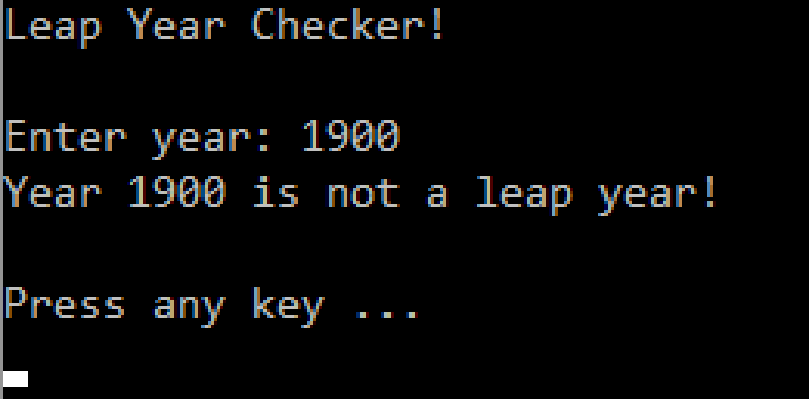
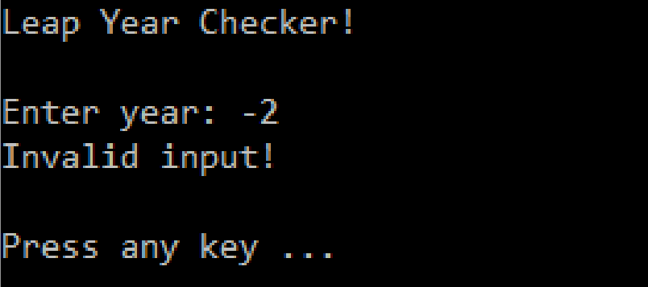
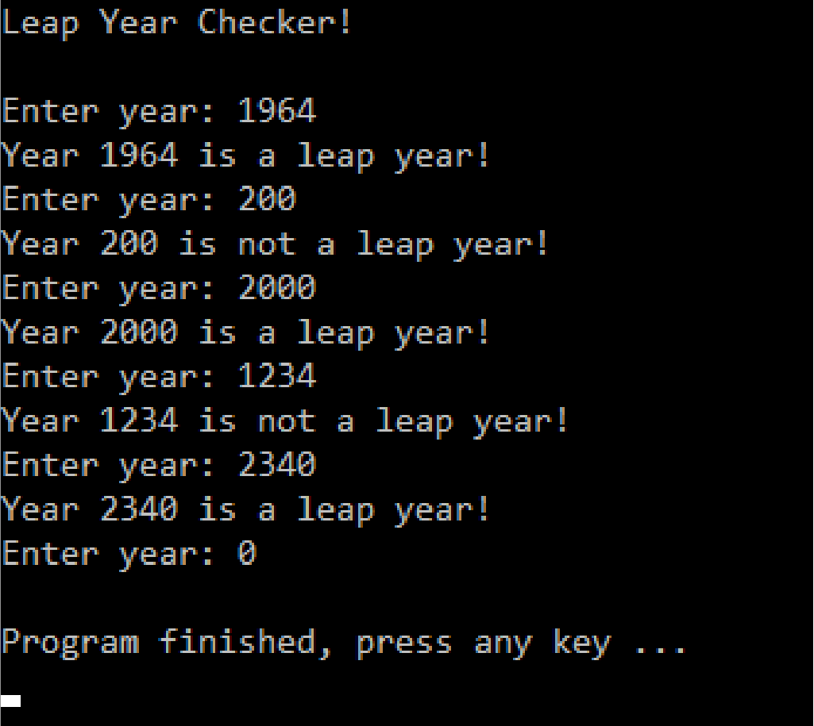

# POSE-LeapYearChecker

## Task 

Write a C# program that checks whether the entered year is a leap year.
Entries < 0 are to be treated as incorrect entries. Create one using PAP
Designer Program flowchart.

The output must be based on the specifications:

### Task for specialists

Repeat the leap year check until year 0 is entered.

The output must be based on the specification:

